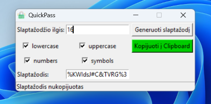

# QuickPass

Paprasta open source slaptažodžių generavimo programėlė, sukurta
naudojant Python. Python pradedantiesiems Code Academy kurso baigiamasis
projektas.

Įdėja - paprasta, minimalistinė ir patogi naudoti aplikacija.

Asmeniškai esu panaudojęs generuoti slaptažodžius web prisijungimams, kurių
reikalavimų neatitikdavo standartinis Chrome slaptažodžių generatorius (pvz.
nepalaikomi simboliai).

## Savybės

- Nedidelis programėlės langas, visada viršuje (on top) naudojimo patogumui
- Galimybė pasirinkti slaptažodžio ilgį
- Pagal poreikį galima pasirinkti mažąsias raides, didžiąsias raides, skaičius ir simbolius
- Sugeneruoto slaptažodžio kopijavimas į iškarpinę
- Vaizdinis pranešimas sėkmingai nukopijavus slaptažodį
- Išsamūs statuso ir klaidų pranešimai
- "Vieno failo" aplikacija

## Techninė informacija

- **Programavimo kalba:** Python
- **Grafinė sąsaja:** Tkinter
- **Programos pakavimas:** PyInstaller
- **Platforma:** Windows

Programėlė supakuota į vieną vykdomąjį .exe failą.

Programos antraštės piktograma yra įdėta tiesiai į programos kodą base64 formatu
ir vykdymo metu atkuriama kaip laikinas failas. Tokiu būdu įgyvendinau "single file"
distribution architektūrą :)

## Projekto kūrimas

Šis projektas buvo sukurtas kaip baigiamasis Python programavimo
pradedančiųjų kurso darbas ir bendrai įvertintas **10/10**.

Kurdamas programą daug dėmesio skyriau jos testavimui - tikrinau
skirtingas įvestis ir išimtinius atvejus, o testavimo metu rastas
problemas taisiau.
